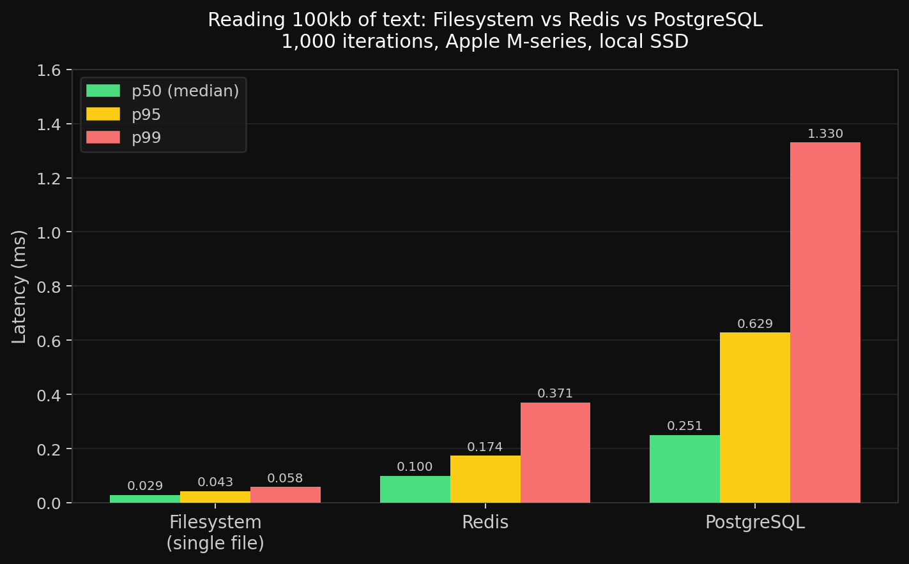

# Filesystem vs Database Latency Benchmark

How fast is reading text from a file compared to Postgres or Redis?

Benchmarks 1,000 reads of ~100kb of text from:
- Filesystem (single file)
- Filesystem (50 concurrent files, same total size)
- PostgreSQL (`SELECT content WHERE id = 1`)
- Redis (`GET`)

## Results

Tested on Apple M-series, local SSD, 1,000 iterations each.



| Backend | p50 | p95 | p99 | mean |
|---|---|---|---|---|
| Filesystem (single file) | 0.029ms | 0.043ms | 0.058ms | 0.031ms |
| Redis | 0.100ms | 0.174ms | 0.371ms | 0.122ms |
| PostgreSQL | 0.251ms | 0.629ms | 1.330ms | 0.313ms |

**File reads are ~3.5x faster than Redis and ~8.7x faster than Postgres at p50.**

For context: a Claude Sonnet call takes 2,000–8,000ms. File I/O is not your bottleneck.

## Run it yourself

Requires Python 3, Postgres, and Redis.

**With Docker:**
```bash
docker compose up -d
pip install -r requirements.txt
python benchmark.py
```

**With Homebrew:**
```bash
brew install postgresql redis
brew services start postgresql redis
createdb benchmark
pip install -r requirements.txt
python benchmark.py
```
